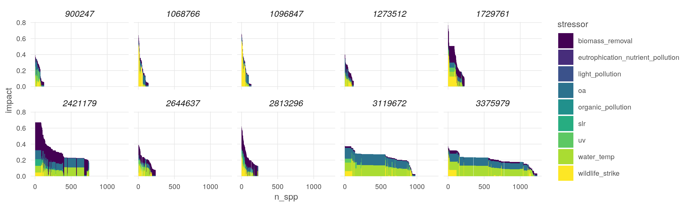
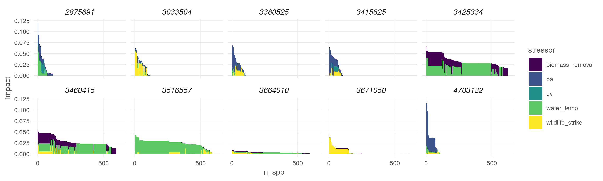

``` {r setup, echo = TRUE, message = FALSE, warning = FALSE}

knitr::opts_chunk$set(fig.width = 6, fig.height = 4, fig.path = 'figs/',
                      echo = TRUE, message = FALSE, warning = FALSE)

library(raster)
source('https://raw.githubusercontent.com/oharac/src/master/R/common.R')

```

# Summary

For each species, sum the total impacts across all stressors.  Then stack all species and create a map of average cumulative impacts.
    
# Methods

## Loop over spp

For each species, gather the species-stressor intersections and add 'em up, and save out.

```{r}
dir_intsx   <- '~/git-annex/spp_vuln/spp_str_intsx'
dir_chi_spp <- '~/git-annex/spp_vuln/spp_chi'

all_fs <- data.frame(f = list.files(dir_intsx, full.names = TRUE)) %>%
  mutate(iucn_sid = str_extract(basename(f), '[0-9]+'),
         iucn_sid = as.integer(iucn_sid))

ids <- all_fs$iucn_sid %>% unique()

tmp <- parallel::mclapply(ids, mc.cores = 16, 
                          FUN = function(id) {
# for(id in ids) { ### id <- ids[1]
    chi_f <- file.path(dir_chi_spp, sprintf('chi_%s.csv', id))
    if(!file.exists(chi_f)) {
      message('Processing ', chi_f)
      id_fs <- all_fs %>%
        filter(iucn_sid == id) %>%
        .$f
      intsx <- lapply(id_fs, read_csv, col_types = 'id') %>%
        setNames(str_replace_all(basename(id_fs), '.+_[0-9]+_|.csv', '')) %>%
        bind_rows(.id = 'stressor') %>%
        group_by(cell_id) %>%
        summarize(chi = sum(impact),
                  n_strs = n_distinct(stressor))
      write_csv(intsx, chi_f)
    }
  })
```

## For all spp

### Collect all spp chi, and calc mean chi per cell

```{r}

chi_stats_f <- '~/git-annex/spp_vuln/chi_stats_by_cell.csv'
if(!file.exists(chi_stats_f)) {
  chi_fs <- list.files(dir_chi_spp, full.names = TRUE)
  
  all_chi <- parallel::mclapply(chi_fs, mc.cores = 16,
                                FUN = function(f) {
                                  x <- read_csv(f, col_types = 'idi')
                                }) %>%
    setNames(chi_fs) %>%
    bind_rows(.id = 'f')
  
  chi_stats <- all_chi %>%
    group_by(cell_id) %>%
    summarize(mean_chi = mean(chi),
              sd_chi = sd(chi),
              mean_strs = mean(n_strs),
              n_spp = n_distinct(f))
  
  write_csv(chi_stats, chi_stats_f)
}

```

### Put into rasters

```{r}
mean_rast_f <- '_output/mean_chi.tif'
sd_rast_f <- '_output/sd_chi.tif'
mean_nstr_rast_f <- '_output/mean_nstr.tif'
nspp_rast_f <- '_output/nspp.tif'

if(any(!file.exists(mean_rast_f, sd_rast_f, mean_nstr_rast_f, nspp_rast_f))) {
  chi_stats <- read_csv(chi_stats_f) %>%
    mutate(mean_chi = round(mean_chi, 4),
           sd_chi = round(sd_chi, 4),
           mean_strs = round(mean_strs, 2))
}

cell_id_rast <- raster('_spatial/cell_id_mol.tif')

if(!file.exists(mean_rast_f)) {
  mean_chi_rast <- subs(cell_id_rast, chi_stats, 
                        by = 'cell_id', which = 'mean_chi',
                        filename = mean_rast_f)
}
if(!file.exists(sd_rast_f)) {
  sd_chi_rast <- subs(cell_id_rast, chi_stats, 
                      by = 'cell_id', which = 'sd_chi',
                      filename = sd_rast_f)
}
if(!file.exists(mean_nstr_rast_f)) {
  mean_nstr_rast <- subs(cell_id_rast, chi_stats, by = 'cell_id', which = 'mean_strs',
                         filename = mean_nstr_rast_f)
}
if(!file.exists(nspp_rast_f)) {
  mean_nstr_rast <- subs(cell_id_rast, chi_stats, by = 'cell_id', which = 'n_spp',
                         filename = nspp_rast_f)
}

mean_chi_rast <- raster(mean_rast_f)
sd_chi_rast <- raster(sd_rast_f)
mean_nstr_rast <- raster(mean_nstr_rast_f)
nspp_rast <- raster(nspp_rast_f)
plot(mean_chi_rast, main = 'mean CHI')
plot(sd_chi_rast, main = 'sd CHI')
plot(mean_nstr_rast, main = 'mean # stressors')
plot(nspp_rast, main = '# spp')

plot(sd_chi_rast / mean_chi_rast, main = 'CV', col = hcl.colors(n = 50))
```
Identify some cells with many spp and high impacts.  Find all spp in these cells, and then read in the species-stressor intersections for them.  Filter to the appropriate cells and plot species-by-species bar charts of stressor intensities.

```{r}
top_btm_spp_f <- '_output/top_btm_10_spp.csv'
if(!file.exists(top_btm_spp_f)) {
  rast_df <- data.frame(cell_id = 1:ncell(mean_chi_rast),
                        chi = values(mean_chi_rast),
                        nspp = values(nspp_rast)) %>%
    filter(!is.na(chi)) %>%
    mutate(dec_nspp = ntile(nspp, n = 10),
           dec_chi  = ntile(chi, n = 10))
  
  set.seed(10101)
  top_chi <- rast_df %>%
    filter(nspp > 100) %>%
    filter(dec_chi == 10) %>%
    sample_n(10)
  
  btm_chi <- rast_df %>%
    filter(nspp > 100) %>%
    filter(dec_chi == 1) %>%
    sample_n(10)
  
  chi_fs <- list.files(dir_chi_spp, full.names = TRUE)
  
  select_spp <- parallel::mclapply(chi_fs, mc.cores = 16,
                                FUN = function(f) {
                                  x <- read_csv(f, col_types = 'idi')
                                }) %>%
    setNames(chi_fs) %>%
    bind_rows(.id = 'f') %>%
    filter(cell_id %in% c(top_chi$cell_id, btm_chi$cell_id)) %>%
    mutate(iucn_sid = str_extract(basename(f), '[0-9]+') %>% as.integer()) %>%
    mutate(rank = ifelse(cell_id %in% top_chi$cell_id, 'high', 'low')) %>%
    select(-f)

  write_csv(select_spp, top_btm_spp_f)
}

top_btm_cells_f <- '_output/top_btm_10_cells.csv'
if(!file.exists(top_btm_cells_f)) {
  select_spp <- read_csv(top_btm_spp_f)
  spp_ids  <- select_spp$iucn_sid %>% unique()
  cell_ids <- unique(select_spp$cell_id)
  
  intsx_fs <- data.frame(f = list.files(dir_intsx, full.names = TRUE)) %>%
    mutate(iucn_sid = str_extract(basename(f), '[0-9]+') %>% as.integer()) %>%
    filter(iucn_sid %in% spp_ids) %>%
    distinct() %>%
    .$f
  
  intsx_fs <- intsx_fs
  
  select_cells <- parallel::mclapply(intsx_fs, mc.cores = 16,
                                FUN = function(f) { # f <- intsx_fs[1]
                                  x <- read_csv(f, col_types = 'idi')
                                }) %>%
    setNames(intsx_fs) %>%
    bind_rows(.id = 'f') %>%
    filter(cell_id %in% cell_ids) %>%
    mutate(iucn_sid = str_extract(basename(f), '[0-9]+') %>% as.integer(),
           stressor = str_replace_all(basename(f), '.+[0-9]_|.csv', '')) %>%
    select(-f)

  write_csv(select_cells, top_btm_cells_f)
}

```


``` {r}
top_btm_ranks <- read_csv(top_btm_spp_f) %>%
  select(cell_id, rank) %>%
  distinct() %>%
  mutate(rank_num = ifelse(rank == 'high', 1, -1))

cell_id_rast  <- raster('_spatial/cell_id_mol.tif')
mean_chi_rast <- raster('_output/mean_chi.tif')

### why is subs not working?
# pts_plot <- subs(x = cell_id_rast, y = top_btm_ranks, by = 'cell_id', which = 'rank_num') 
x <- raster(cell_id_rast)
hi <- top_btm_ranks %>% filter(rank == 'high') %>% .$cell_id
lo <- top_btm_ranks %>% filter(rank == 'low') %>% .$cell_id
values(x)[values(cell_id_rast) %in% hi] <- 2
values(x)[values(cell_id_rast) %in% lo] <- 1
y <- rasterToPoints(x) %>%
  as.data.frame() %>%
  mutate(rank = ifelse(layer == 1, 'low', 'high'))

xfm <- function(x) {
  cutoff <- quantile(x, .9999, na.rm = TRUE)
  y <- x / cutoff
  y[y > 1] <- 1
  return(sqrt(y))
}

chi_df <- rasterToPoints(mean_chi_rast) %>%
  as.data.frame() %>%
  arrange(mean_chi) %>%
  mutate(xfm_chi = xfm(mean_chi)) # %>%
  # mutate(pct_chi = ntile(mean_chi, n = 100))

lbls <- c(.01, .1, .2, .5, 1)
ggplot() +
  ggtheme_map() +
  geom_raster(data = chi_df, aes(x, y, fill = xfm_chi)) +
  geom_point(data = y, aes(x, y, color = rank)) +
  scale_fill_viridis_c(labels = lbls, breaks = xfm(lbls), option = 'viridis') +
  scale_color_manual(values = c('red', 'green')) +
  coord_sf() +
  labs(color = 'CHI rank', fill = 'mean CHI')

# ggplot() +
#   ggtheme_map() +
#   geom_raster(data = chi_df, aes(x, y, fill = pct_chi)) +
#   geom_point(data = y, aes(x, y, color = rank)) +
#   scale_fill_viridis_c(option = 'viridis') +
#   scale_color_manual(values = c('red', 'green')) +
#   coord_sf() +
#   labs(color = 'CHI rank', fill = 'mean CHI %ile')
```

``` {r}
cell_spp_chi <- read_csv(top_btm_cells_f) %>%
  group_by(cell_id, iucn_sid) %>%
  summarize(chi = sum(impact)) %>%
  group_by(cell_id) %>%
  arrange(cell_id, desc(chi)) %>%
  mutate(id = 1:n()) 

plot_df <- read_csv(top_btm_cells_f) %>%
  left_join(cell_spp_chi, by = c('cell_id', 'iucn_sid')) %>%
  left_join(top_btm_ranks, by = 'cell_id')

x <- ggplot(plot_df %>% filter(rank == 'high')) +
  ggtheme_plot() +
  geom_col(aes(x = id, y = impact, fill = stressor), width = 1, position = 'stack') +
  scale_x_continuous(breaks = seq(0, 1500, 500)) +
  scale_fill_viridis_d() +
  facet_wrap(~cell_id, ncol = 2) +
  labs(x = 'n_spp')

ggsave('high_cells_dists.png', height = 8, width = 6, dpi = 300)


x <- ggplot(plot_df %>% filter(rank == 'low')) +
  ggtheme_plot() +
  geom_col(aes(x = id, y = impact, fill = stressor), width = 1, position = 'stack') +
  scale_x_continuous(breaks = seq(0, 1500, 500)) +
  scale_fill_viridis_d() +
  facet_wrap(~cell_id, ncol = 2) +
  labs(x = 'n_spp')

ggsave('low_cells_dists.png', height = 8, width = 6, dpi = 300)

```


## By taxon

### Collect all spp chi, and calc mean chi per cell


```{r}
spp_taxa <- read_csv(here('_raw/spp_ranks.csv')) %>% rename(taxon = rank)
chi_f_df <- data.frame(f = list.files(dir_chi_spp, full.names = TRUE)) %>%
  mutate(iucn_sid = str_extract(basename(f), '[0-9]+') %>% as.integer() %>% unique()) %>%
  left_join(spp_taxa, by = 'iucn_sid')
taxa <- spp_taxa$taxon %>% unique()

for(t in taxa) { ### t <- taxa[1]
  
  t_chi_outfile <- sprintf('~/git-annex/spp_vuln/int/t_chi_%s.csv', tolower(t))
  
  if(!file.exists(t_chi_outfile)) {
    
    chi_fs <- chi_f_df %>%
      filter(taxon == t) %>%
      .$f
    t_chi <- parallel::mclapply(chi_fs, mc.cores = 16,
        FUN = function(f) {
          x <- read_csv(f, col_types = 'idi')
                                  }) %>%
      setNames(chi_fs) %>%
      bind_rows(.id = 'f')
  
    n_gps <- 24
    t_cells <- data.frame(cell_id = t_chi$cell_id %>% unique() %>% sort()) %>%
      mutate(cell_gp = rep(1:n_gps, length.out = n()))
    
    t_chi_stats_l <- parallel::mclapply(1:n_gps, mc.cores = n_gps,
        FUN = function(gp) { ### gp <- 1
          df <- t_cells %>% filter(cell_gp == gp)
          t_chi_gp <- t_chi %>%
            filter(cell_id %in% df$cell_id)
          t_chi_gp_sum <- t_chi_gp %>%
            # mutate(iucn_sid = str_extract(basename(f), '[0-9]+') %>% as.integer()) %>%
            group_by(cell_id) %>%
            summarize(mean_chi = mean(chi) %>% round(5),
                      sd_chi = sd(chi) %>% round(5),
                      mean_strs = mean(n_strs) %>% round(2),
                      n_spp = n_distinct(f))
        })
    t_chi_stats <- bind_rows(t_chi_stats_l)
  
    write_csv(t_chi_stats, t_chi_outfile)
  } else {
    message('File exists: ', t_chi_outfile, '... skipping!')
  }
}

```

### Put a few taxa into rasters

```{r}
plot_map <- function(r, t, f = 'mean CHI') {
  df <- rasterToPoints(r) %>%
    as.data.frame() %>%
    setNames(c('x', 'y', 'chi')) %>%
    mutate(xfm_chi = xfm(chi))
  x <- ggplot() +
    ggtheme_map() +
    geom_raster(data = df, aes(x, y, fill = xfm_chi)) +
    scale_fill_viridis_c(labels = lbls, breaks = xfm(lbls), option = 'viridis') +
    coord_sf() +
    labs(fill = f, title = t)
  print(x)
}

create_rast <- function(t) { # t <- taxa[1]
  f <- sprintf('_output/mean_chi_%s.tif', tolower(t))
  if(!file.exists(f)) {
    csv <- sprintf('~/git-annex/spp_vuln/int/t_chi_%s.csv', tolower(t))
    chi_df <- read_csv(csv)
    r <- subs(cell_id_rast, chi_df, 
              by = 'cell_id', which = 'mean_chi',
              filename = f, overwrite = TRUE)
  } else {
    r <- raster(f)
  }
  return(r)
}

xfm <- function(x) {
  cutoff <- quantile(x, .9999, na.rm = TRUE)
  y <- x / cutoff
  y[y > 1] <- 1
  return(sqrt(y))
}
```

``` {r}
cell_id_rast <- raster('_spatial/cell_id_mol.tif')

for(t in taxa) {
  r <- create_rast(t = tolower(t))
  plot_map(r, t = tolower(t))
}

```


## By species

### Choose a few key species and plot maps

