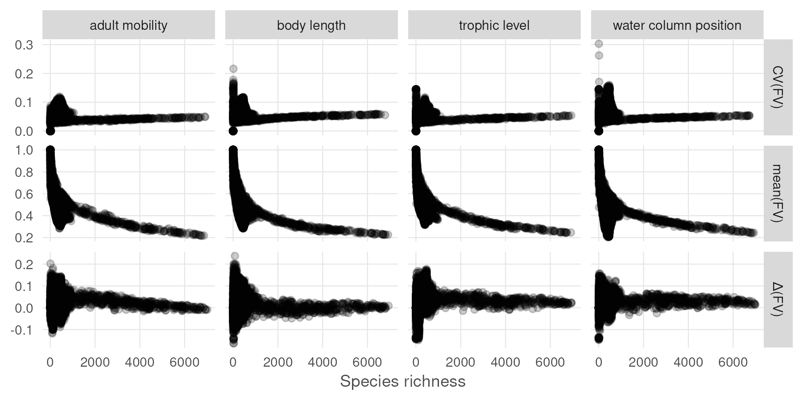

``` {r setup, echo = TRUE, message = FALSE, warning = FALSE}

knitr::opts_chunk$set(echo = TRUE, message = FALSE, warning = FALSE,
                      fig.height = 4, fig.width = 7)

library(terra)
library(sf)
library(oharac)
library(data.table)
library(tidyverse)
library(here)
source(here('common_fxns.R'))
```

# Summary

Sensitivity analysis to determine how drastically scores change with different values of functional traits.  

In script 4a, we calculated sensitivity around functional diversity metrics and per-stressor impacts.  In 4b, we aggregate results across all stressors for each randomized iteration, to determine the distribution of mean values for cumulative impacts.  Here, we map them out and make cool figures.

# Methods

For each randomized trait, plot the variation in functional diversity metrics for the sampled points, with a nearest-neighbor interpolation to help spot regional variation.  We will examine several stats: absolute and relative difference, relative 95% confidence interval (CI divided by mean), coefficient of variance (std dev divided by mean)

```{r get cell id to xy}
ocean_r <- rast(here('_spatial/ocean_area_mol.tif'))
cell_xy <- ocean_r %>% 
  setValues(1:ncell(.)) %>%
  setNames('cell_id') %>%
  as.data.frame(xy = TRUE)
```

```{r gather fd metrics}
fd_fs <- list.files(here_anx('sens_analysis/funct_div_summary'), 
                    pattern = '.csv', full.names = TRUE)
fd_ts <- basename(fd_fs) %>% str_remove_all('.+_shuffle_|.csv')


fd_df <- lapply(fd_fs, fread) %>%
  setNames(fd_ts) %>%
  rbindlist(idcol = 't') %>%
  mutate(n_fe_diff = n_fe_mean - n_fe,
         fv_diff = fv_mean - fv,
         n_fe_ci = (n_fe_95hi - n_fe_95lo) / n_fe_mean,
         fv_ci   = (fv_95hi - fv_95lo) / fv_mean,
         n_fe_cv = n_fe_sdev / n_fe_mean,
         fv_cv   = fv_sdev / fv_mean) %>%
  select(cell_id, t, nspp,
         n_fe_mean, n_fe_diff,
         fv_mean, fv_diff,
         n_fe_ci, fv_ci, n_fe_cv, fv_cv) %>%
  pivot_longer(cols = -c(cell_id, t, nspp),
               names_to = 'var', values_to = 'val') %>%
  mutate(param = str_extract(var, 'n_fe|fv'),
         stat  = str_extract(var, 'mean|sdev|ci|cv|diff')) %>%
  select(-var) %>%
  left_join(cell_xy, by = 'cell_id')

```

## Functional diversity metrics

### Maps of functional vulnerability

How does functional vulnerability vary as traits are randomized?

```{r get land and ocean borders}
land_sf <- read_sf(here('_spatial/ne_10m_land/ne_10m_land_no_casp.shp')) %>%
  st_transform(st_crs(ocean_r))

globe_bbox <- rbind(c(-180, -90), c(-180, 90), 
                      c(180, 90), c(180, -90), c(-180, -90)) 
globe_border <- st_polygon(list(globe_bbox)) %>%
  st_sfc(crs = 4326) %>%
  st_sf(data.frame(rgn = 'globe', geom = .)) %>%
  smoothr::densify(max_distance = 0.5) %>%
  st_transform(crs = crs(ocean_r))
```

```{r function to generate map}
map_param <- function(df, s, p, r = ocean_r) {
  mtx <- df %>%
    filter(stat == s & param == p) %>%
    select(x, y, z = val) %>%
    as.matrix()
  
  r_out <- interpNear(r, mtx, radius = 500000) %>%
    mask(r)
  
  return(r_out)
}

finish_map <- function(p, div = TRUE) {
  ### div is whether the palette should be a diverging palette (TRUE) or
  ### sequential (FALSE)

  p <- p +
    ### continents:
    geom_sf(data = land_sf,
            fill = 'grey96', color = 'grey40', 
            size = .10) +
    geom_sf(data = globe_border,
            fill = NA, color = 'grey70', 
            size = .1) +
    scale_x_continuous(expand = c(0, 0)) +
    scale_y_continuous(expand = c(0, 0)) +
    facet_wrap(~ trait) +
    theme_void()
  
  if(div) {
    ### diverging palette
    p <- p + 
      scale_fill_gradient2(low = '#d01c8b', mid = '#ffffdf', high = '#4dac26')
  } else {
    ### sequential palette
    p <- p + scale_fill_viridis_c()
  }
  
  return(p)
}
```

```{r map difference in fv}
fv_fig_f <- '_figs/fv_diff_by_trait_map.png'

if(!file.exists(fv_fig_f)) {
  fv_map_list <- vector('list', length = length(fd_ts)) %>%
    setNames(fd_ts)
  for(trait in fd_ts) {
    fv_map_list[[trait]] <- map_param(df = fd_df %>% filter(t == trait), 
                                      p = 'fv', s = 'diff')
  }
  
  fv_map_stack <- rast(fv_map_list)
  
  fv_map_df <- as.data.frame(fv_map_stack, xy = TRUE) %>%
    pivot_longer(-c(x, y), names_to = 'trait', values_to = 'delta_fv') %>%
    mutate(trait = case_when(trait == 'len' ~ 'body length',
                             trait == 'mob' ~ 'adult mobility',
                             trait == 'trp' ~ 'trophic level',
                             trait == 'wcol' ~ 'water column position'))
    
  p <- ggplot() +
    geom_raster(data = fv_map_df, aes(x, y, fill = delta_fv)) +
    labs(fill = 'ΔFV')
  
  p <- finish_map(p)
  
  ggsave(fv_fig_f, width = 6.5, height = 3, dpi = 300)
  
}
knitr::include_graphics(fv_fig_f)
  # tbd
  ### param dist plot
  # tbd
  ### spp vs param plot
  

```

```{r map difference in fv}
fv_fig_f <- '_figs/fv_cv_by_trait_map.png'

if(!file.exists(fv_fig_f)) {
  fv_map_list <- vector('list', length = length(fd_ts)) %>%
    setNames(fd_ts)
  for(trait in fd_ts) {
    fv_map_list[[trait]] <- map_param(df = fd_df %>% filter(t == trait), 
                                      p = 'fv', s = 'cv')
  }
  
  fv_map_stack <- rast(fv_map_list)
  
  fv_map_df <- as.data.frame(fv_map_stack, xy = TRUE) %>%
    pivot_longer(-c(x, y), names_to = 'trait', values_to = 'cv_fv') %>%
    mutate(trait = case_when(trait == 'len' ~ 'body length',
                             trait == 'mob' ~ 'adult mobility',
                             trait == 'trp' ~ 'trophic level',
                             trait == 'wcol' ~ 'water column position'))
    
  p <- ggplot() +
    geom_raster(data = fv_map_df, aes(x, y, fill = cv_fv)) +
    labs(fill = 'CV(FV)')
  
  p <- finish_map(p, div = FALSE)
  
  ggsave(fv_fig_f, width = 6.5, height = 3, dpi = 300)

}
knitr::include_graphics(fv_fig_f)

```

### Plots of functional diversity parameters vs. number of species

How do functional diversity metrics (FV and number of FEs) vary as traits are randomized, relative to the number of species in a given pixel?

```{r fv plots}
fv_plot_df <- fd_df %>%
  filter(stat %in% c('mean', 'cv', 'diff')) %>%
  filter(param == 'fv') %>%
  mutate(metric = paste(stat, param)) %>%
  mutate(metric = str_replace(metric, 'fv', '(FV)'),
         metric = str_replace(metric, 'mean ', 'mean'),
         metric = str_replace(metric, 'cv ', 'CV'),
         metric = str_replace(metric, 'diff ', 'Δ')) %>%
  mutate(t = case_when(t == 'len' ~ 'body length',
                       t == 'mob' ~ 'adult mobility',
                       t == 'trp' ~ 'trophic level',
                       t == 'wcol' ~ 'water column position')) %>%
  sample_frac(.1)

p <- ggplot(fv_plot_df, aes(x = nspp, y = val)) +
  geom_point(alpha = .2) +
  theme_ohara() +
  facet_grid(metric ~ t, scales = 'free_y') +
  labs(x = 'Species richness') +
  theme(axis.title.y = element_blank())

ggsave('_figs/fv_stat_by_trait_scatter.png', width = 6, height = 3, dpi = 300)


```

```{r n_fe plots}
fe_plot_df <- fd_df %>%
  filter(stat %in% c('mean', 'cv', 'diff')) %>%
  filter(param == 'n_fe') %>%
  mutate(metric = paste(stat, param)) %>%
  mutate(metric = str_replace(metric, 'n_fe', '(# FE)'),
         metric = str_replace(metric, 'mean ', 'mean'),
         metric = str_replace(metric, 'cv ', 'CV'),
         metric = str_replace(metric, 'diff ', 'Δ')) %>%
  mutate(t = case_when(t == 'len' ~ 'body length',
                       t == 'mob' ~ 'adult mobility',
                       t == 'trp' ~ 'trophic level',
                       t == 'wcol' ~ 'water column position')) %>%
  sample_frac(.1)

p <- ggplot(fe_plot_df, aes(x = nspp, y = val)) +
  geom_point(alpha = .2) +
  theme_ohara() +
  facet_grid(metric ~ t, scales = 'free_y') +
  labs(x = 'Species richness') +
  theme(axis.title.y = element_blank())

ggsave('_figs/n_fe_stat_by_trait_scatter.png', width = 6, height = 3, dpi = 300)


```


## Cumulative impact metrics

### Maps of cumulative impact variation

How does cumulative impact vary as traits are randomized?

```{r gather chi metrics}
chi_fs <- list.files(here_anx('sens_analysis/impact_summary'), 
                    pattern = 'chi_.+.csv', full.names = TRUE)
chi_ts <- basename(chi_fs) %>% str_remove_all('.+_shuffle_|.csv')

chi_true_df <- rast(here('_output/cumulative_impact_maps/chi_funct_entity.tif')) %>%
  as.data.frame(xy = TRUE) %>%
  oharac::dt_join(cell_xy, by = c('x', 'y'), type = 'left') %>%
  filter(cell_id %in% fd_df$cell_id)

nspp_df <- fd_df %>%
  select(cell_id, nspp) %>%
  distinct()

chi_df <- lapply(chi_fs, fread) %>%
  setNames(chi_ts) %>%
  rbindlist(idcol = 't') %>%
  left_join(chi_true_df, by = 'cell_id') %>%
  left_join(nspp_df, by = 'cell_id') %>%
  mutate(chi_diff = chi_mean - chi_fe,
         chi_ci = (chi_95hi - chi_95lo) / chi_mean,
         chi_cv = chi_sdev / chi_mean) %>%
  select(cell_id, t, nspp,
         chi_mean, chi_diff,
         chi_ci, chi_cv) %>%
  pivot_longer(cols = -c(cell_id, t, nspp),
               names_to = 'var', values_to = 'val') %>%
  mutate(param = 'chi',
         stat  = str_extract(var, 'mean|sdev|ci|cv|diff')) %>%
  select(-var) %>%
  left_join(cell_xy, by = 'cell_id')

```


```{r map difference in chi}
chi_fig_f <- '_figs/chi_diff_by_trait_map.png'

if(!file.exists(chi_fig_f)) {
  chi_map_list <- vector('list', length = length(chi_ts)) %>%
    setNames(chi_ts)
  for(trait in fd_ts) {
    chi_map_list[[trait]] <- map_param(df = chi_df %>% filter(t == trait), 
                                       p = 'chi', s = 'diff')
  }
  
  chi_map_stack <- rast(chi_map_list)
  
  chi_map_df <- as.data.frame(chi_map_stack, xy = TRUE) %>%
    pivot_longer(-c(x, y), names_to = 'trait', values_to = 'delta_chi') %>%
    mutate(trait = case_when(trait == 'len' ~ 'body length',
                             trait == 'mob' ~ 'adult mobility',
                             trait == 'trp' ~ 'trophic level',
                             trait == 'wcol' ~ 'water column position'))
    
  p <- ggplot() +
    geom_raster(data = chi_map_df, aes(x, y, fill = delta_chi)) +
    labs(fill = 'ΔFV')
  
  p <- finish_map(p)
  
  ggsave(chi_fig_f, width = 6.5, height = 3, dpi = 300)
  
}
knitr::include_graphics(chi_fig_f)
  # tbd
  ### param dist plot
  # tbd
  ### spp vs param plot
  

```

```{r map difference in fv}
fv_fig_f <- '_figs/fv_cv_by_trait_map.png'

if(!file.exists(fv_fig_f)) {
  fv_map_list <- vector('list', length = length(fd_ts)) %>%
    setNames(fd_ts)
  for(trait in fd_ts) {
    fv_map_list[[trait]] <- map_param(df = fd_df %>% filter(t == trait), 
                                      p = 'fv', s = 'cv')
  }
  
  fv_map_stack <- rast(fv_map_list)
  
  fv_map_df <- as.data.frame(fv_map_stack, xy = TRUE) %>%
    pivot_longer(-c(x, y), names_to = 'trait', values_to = 'cv_fv') %>%
    mutate(trait = case_when(trait == 'len' ~ 'body length',
                             trait == 'mob' ~ 'adult mobility',
                             trait == 'trp' ~ 'trophic level',
                             trait == 'wcol' ~ 'water column position'))
    
  p <- ggplot() +
    geom_raster(data = fv_map_df, aes(x, y, fill = cv_fv)) +
    labs(fill = 'CV(FV)')
  
  p <- finish_map(p, div = FALSE)
  
  ggsave(fv_fig_f, width = 6.5, height = 3, dpi = 300)

}
knitr::include_graphics(fv_fig_f)

```

### Plots of functional diversity parameters vs. number of species

How do functional diversity metrics (FV and number of FEs) vary as traits are randomized, relative to the number of species in a given pixel?

```{r fv plots}
fv_plot_df <- fd_df %>%
  filter(stat %in% c('mean', 'cv', 'diff')) %>%
  filter(param == 'fv') %>%
  mutate(metric = paste(stat, param)) %>%
  mutate(metric = str_replace(metric, 'fv', '(FV)'),
         metric = str_replace(metric, 'mean ', 'mean'),
         metric = str_replace(metric, 'cv ', 'CV'),
         metric = str_replace(metric, 'diff ', 'Δ')) %>%
  mutate(t = case_when(t == 'len' ~ 'body length',
                       t == 'mob' ~ 'adult mobility',
                       t == 'trp' ~ 'trophic level',
                       t == 'wcol' ~ 'water column position')) %>%
  sample_frac(.1)

p <- ggplot(fv_plot_df, aes(x = nspp, y = val)) +
  geom_point(alpha = .2) +
  theme_ohara() +
  facet_grid(metric ~ t, scales = 'free_y') +
  labs(x = 'Species richness') +
  theme(axis.title.y = element_blank())

ggsave('_figs/fv_stat_by_trait_scatter.png', width = 6, height = 3, dpi = 300)


```

```{r n_fe plots}
fe_plot_df <- fd_df %>%
  filter(stat %in% c('mean', 'cv', 'diff')) %>%
  filter(param == 'n_fe') %>%
  mutate(metric = paste(stat, param)) %>%
  mutate(metric = str_replace(metric, 'n_fe', '(# FE)'),
         metric = str_replace(metric, 'mean ', 'mean'),
         metric = str_replace(metric, 'cv ', 'CV'),
         metric = str_replace(metric, 'diff ', 'Δ')) %>%
  mutate(t = case_when(t == 'len' ~ 'body length',
                       t == 'mob' ~ 'adult mobility',
                       t == 'trp' ~ 'trophic level',
                       t == 'wcol' ~ 'water column position')) %>%
  sample_frac(.1)

p <- ggplot(fe_plot_df, aes(x = nspp, y = val)) +
  geom_point(alpha = .2) +
  theme_ohara() +
  facet_grid(metric ~ t, scales = 'free_y') +
  labs(x = 'Species richness') +
  theme(axis.title.y = element_blank())

ggsave('_figs/n_fe_stat_by_trait_scatter.png', width = 6, height = 3, dpi = 300)


```
