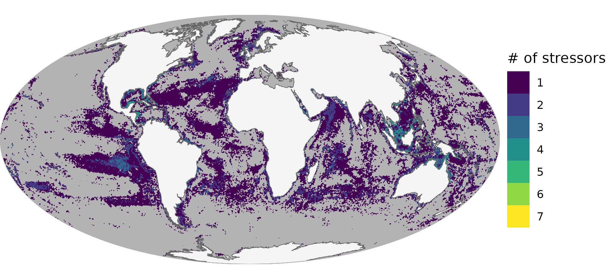
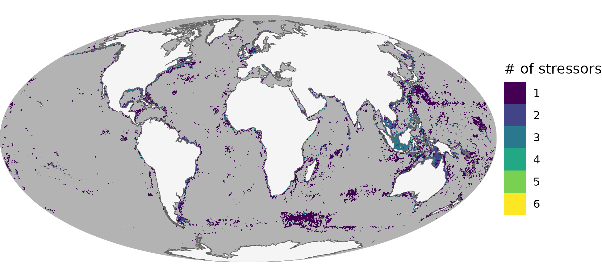

``` {r setup, echo = TRUE, message = FALSE, warning = FALSE}

knitr::opts_chunk$set(echo = TRUE, message = FALSE, warning = FALSE,
                      fig.height = 4, fig.width = 7)

library(terra)
library(sf)
library(oharac)
library(data.table)
library(tidyverse)
library(here)
source(here('common_fxns.R'))
```

# Summary

Sensitivity analysis to determine how drastically scores change with different values of functional traits.  

In script 5a, we calculated sensitivity around species and FE impacts by resampling species distributions in each sample cell 1000 times.   In 5b, we aggregate results across all stressors for each randomized iteration, to determine the distribution of mean values and confidence intervals for cumulative impacts.  Here, we map them out and make cool figures.

# Methods

For each randomized species set, plot the difference between the FE approach and the species approach, at full cumulative, as well as climate vs. non-climate stressors.  Additionally, we can count up how many stressors are significantly higher for FE vs. spp (and how many are significantly lower) separate from the aggregated totals (which can obscure significance at the individual stressor view).

To determine statistical significance of differences between the two approaches, we will look at the 95% confidence interval around the *difference* in mean between the FE approach and the species approach.

```{r get cell id to xy}
ocean_r <- rast(here('_spatial/ocean_area_mol.tif'))
cell_xy <- ocean_r %>% 
  setValues(1:ncell(.)) %>%
  setNames('cell_id') %>%
  as.data.frame(xy = TRUE)
```

```{r}
land_sf <- read_sf(here('_spatial/ne_10m_land/ne_10m_land_no_casp.shp')) %>%
  st_transform(st_crs(ocean_r))

globe_bbox <- rbind(c(-180, -90), c(-180, 90), 
                      c(180, 90), c(180, -90), c(-180, -90)) 
globe_border <- st_polygon(list(globe_bbox)) %>%
  st_sfc(crs = 4326) %>%
  st_sf(data.frame(rgn = 'globe', geom = .)) %>%
  smoothr::densify(max_distance = 0.5) %>%
  st_transform(crs = crs(ocean_r))

finish_map <- function(p, div = TRUE) {
  ### div is whether the palette should be a diverging palette (TRUE) or
  ### sequential (FALSE)

  p <- p +
    ### continents:
    geom_sf(data = land_sf,
            fill = 'grey96', color = 'grey40', 
            size = .10) +
    geom_sf(data = globe_border,
            fill = NA, color = 'grey70', 
            size = .1) +
    scale_x_continuous(expand = c(0, 0)) +
    scale_y_continuous(expand = c(0, 0)) +
    theme_void()
  
  if(div) {
    ### diverging palette
    p <- p + 
      scale_fill_gradient2(high = '#d01c8b', mid = '#ffffdf', low = '#4dac26')
  } else {
    ### sequential palette
    p <- p + scale_fill_viridis_c()
  }
  
  return(p)
}
```

## Cumulative impact metrics

### Maps of cumulative impact variation

How does cumulative impact vary as species sets are randomized?

```{r gather chi metrics}
chi_f <- here_anx('spp_vs_fe_sensitivity_analysis/impact_summary', 'chi_shuffle_species.csv')

chi_df <- fread(chi_f) %>%
  mutate(diff_sig = diff_95lo * diff_95hi > 0) %>% 
    ### if lo and hi are on opposite sides of zero, then not sig
  mutate(diff = chi_mean_fe - chi_mean_spp) %>%
  left_join(cell_xy, by = 'cell_id')

```


```{r map difference in chi}
chi_fig_f <- '_figs/chi_diff_fe_vs_spp_map.png'

if(!file.exists(chi_fig_f)) {
  
  diff_mtx <- chi_df %>%
    select(x, y, z = diff) %>%
    as.matrix()
  sig_mtx <- chi_df %>%
    select(x, y, z = diff_sig) %>%
    as.matrix()
  
  diff_r <- interpNear(ocean_r, diff_mtx, radius = 500000) %>%
    mask(ocean_r)
  sig_r <- interpNear(ocean_r, sig_mtx, radius = 500000) %>%
    mask(ocean_r)

  sig_diff_map <- diff_r %>%
    setNames('chi_diff_spp_fe')
  sig_diff_map[sig_r == 0] <- NA

  chi_diff_map_df <- as.data.frame(sig_diff_map, xy = TRUE)
    
  p <- ggplot() +
    geom_raster(data = as.data.frame(ocean_r, xy = TRUE), aes(x, y), fill = 'grey70') +
    geom_raster(data = chi_diff_map_df, aes(x, y, fill = chi_diff_spp_fe)) +
    labs(fill = 'ΔCHI')
  
  p <- finish_map(p)
  
  ggsave(chi_fig_f, width = 6.5, height = 3, dpi = 300)
  
}
knitr::include_graphics(chi_fig_f)

```

### Maps of non-climate cumulative impact variation

How does cumulative impact vary as species sets are randomized?

```{r gather noncc chi metrics}
chi_noncc_f <- here_anx('spp_vs_fe_sensitivity_analysis/impact_summary', 'chi_noncc_shuffle_species.csv')

chi_noncc_df <- fread(chi_noncc_f) %>%
  mutate(diff_sig = diff_95lo * diff_95hi > 0) %>% 
    ### if lo and hi are on opposite sides of zero, then not sig
  mutate(diff = chi_mean_fe - chi_mean_spp) %>%
  left_join(cell_xy, by = 'cell_id')

```


```{r map difference in noncc chi}
chi_noncc_fig_f <- '_figs/chi_noncc_diff_fe_vs_spp_map.png'

if(!file.exists(chi_noncc_fig_f)) {
  
  diff_mtx <- chi_noncc_df %>%
    select(x, y, z = diff) %>%
    as.matrix()
  sig_mtx <- chi_noncc_df %>%
    select(x, y, z = diff_sig) %>%
    as.matrix()
  
  diff_r <- interpNear(ocean_r, diff_mtx, radius = 500000) %>%
    mask(ocean_r)
  sig_r <- interpNear(ocean_r, sig_mtx, radius = 500000) %>%
    mask(ocean_r)

  sig_diff_map <- diff_r %>%
    setNames('chi_diff_spp_fe')
  sig_diff_map[sig_r == 0] <- NA

  chi_diff_map_df <- as.data.frame(sig_diff_map, xy = TRUE)
    
  p <- ggplot() +
    geom_raster(data = as.data.frame(ocean_r, xy = TRUE), aes(x, y), fill = 'grey70') +
    geom_raster(data = chi_diff_map_df, aes(x, y, fill = chi_diff_spp_fe)) +
    labs(fill = 'ΔCHI')
  
  p <- finish_map(p)
  
  ggsave(chi_noncc_fig_f, width = 6.5, height = 3, dpi = 300)
  
}
knitr::include_graphics(chi_noncc_fig_f)

```


### Maps of climate cumulative impact variation

How does cumulative impact vary as species sets are randomized?

```{r gather cc chi metrics}
chi_cc_f <- here_anx('spp_vs_fe_sensitivity_analysis/impact_summary', 'chi_cc_shuffle_species.csv')

chi_cc_df <- fread(chi_cc_f) %>%
  mutate(diff_sig = diff_95lo * diff_95hi > 0) %>% 
    ### if lo and hi are on opposite sides of zero, then not sig
  mutate(diff = chi_mean_fe - chi_mean_spp) %>%
  left_join(cell_xy, by = 'cell_id')

```


```{r map difference in cc chi}
chi_cc_fig_f <- '_figs/chi_cc_diff_fe_vs_spp_map.png'

if(!file.exists(chi_cc_fig_f)) {
  
  diff_mtx <- chi_cc_df %>%
    select(x, y, z = diff) %>%
    as.matrix()
  sig_mtx <- chi_cc_df %>%
    select(x, y, z = diff_sig) %>%
    as.matrix()
  
  diff_r <- interpNear(ocean_r, diff_mtx, radius = 500000) %>%
    mask(ocean_r)
  sig_r <- interpNear(ocean_r, sig_mtx, radius = 500000) %>%
    mask(ocean_r)

  sig_diff_map <- diff_r %>%
    setNames('chi_diff_spp_fe')
  sig_diff_map[sig_r == 0] <- NA

  chi_diff_map_df <- as.data.frame(sig_diff_map, xy = TRUE)
    
  p <- ggplot() +
    geom_raster(data = as.data.frame(ocean_r, xy = TRUE), aes(x, y), fill = 'grey70') +
    geom_raster(data = chi_diff_map_df, aes(x, y, fill = chi_diff_spp_fe)) +
    labs(fill = 'ΔCHI')
  
  p <- finish_map(p)
  
  ggsave(chi_cc_fig_f, width = 6.5, height = 3, dpi = 300)
  
}
knitr::include_graphics(chi_cc_fig_f)

```

### Maps of variation in impact from individual stressors

How does per-stressor impact vary as species sets are randomized?

```{r gather individual impact metrics}
impact_fs <- list.files(here_anx('spp_vs_fe_sensitivity_analysis/impact_summary'),
                        pattern = 'impact_.+_shuffle_species.csv',
                        full.names = TRUE)
str_vec <- impact_fs %>%
  basename() %>%
  str_remove_all('impact_|_shuffle.+')

names(impact_fs) <- str_vec

for(s in str_vec) {
  # s <- str_vec[1]
  impact_fig_f <- sprintf('_figs/impact_%s_diff_fe_vs_spp_map.png', s)
  
  if(!file.exists(impact_fig_f)) {
  
    impact_df <- fread(impact_fs[s]) %>%
      mutate(diff_sig = diff_95lo * diff_95hi > 0) %>% 
        ### if lo and hi are on opposite sides of zero, then not sig
      select(cell_id, impact_mean_spp, impact_mean_fe, diff_sig) %>%
      mutate(diff = impact_mean_fe - impact_mean_spp) %>%
      left_join(cell_xy, by = 'cell_id')
  
    
    diff_mtx <- impact_df %>%
      select(x, y, z = diff) %>%
      as.matrix()
    sig_mtx <- impact_df %>%
      select(x, y, z = diff_sig) %>%
      as.matrix()
    
    diff_r <- interpNear(ocean_r, diff_mtx, radius = 500000) %>%
      mask(ocean_r)
    sig_r <- interpNear(ocean_r, sig_mtx, radius = 500000) %>%
      mask(ocean_r)
  
    sig_diff_map <- diff_r %>%
      setNames('impact_diff_spp_fe')
    sig_diff_map[sig_r == 0] <- NA
  
    impact_diff_map_df <- as.data.frame(sig_diff_map, xy = TRUE)
      
    p <- ggplot() +
      geom_raster(data = as.data.frame(ocean_r, xy = TRUE), aes(x, y), fill = 'grey70') +
      geom_raster(data = impact_diff_map_df, aes(x, y, fill = impact_diff_spp_fe)) +
      labs(fill = 'ΔCHI')
    
    p <- finish_map(p) +
      labs(title = s)
    
    ggsave(impact_fig_f, width = 6.5, height = 3, dpi = 300)
    
  }
 
  knitr::include_graphics(impact_fig_f)
}

```


### Maps of variation in impact from individual stressors

How many stressors have significant differences between FV and spp as species sets are randomized?  AND - do we want to just focus on areas where FV is significantly GREATER?

```{r make map of signif higher stressors by count}

str_sig_count_f <- 'fe_vs_spp_sig_higher_n_stressors.tif'

if(!file.exists(str_sig_count_f)) {
  impact_fs <- list.files(here_anx('spp_vs_fe_sensitivity_analysis/impact_summary'),
                          pattern = 'impact_.+_shuffle_species.csv',
                          full.names = TRUE)
  str_vec <- impact_fs %>%
    basename() %>%
    str_remove_all('impact_|_shuffle.+')
  
  names(impact_fs) <- str_vec
  
  lyrs_out <- vector('list', length = length(str_vec)) %>%
    setNames(str_vec)
  
  for(s in str_vec) {
    # s <- str_vec[1]

    impact_df <- fread(impact_fs[s]) %>%
      mutate(diff_sig = diff_95lo * diff_95hi > 0) %>% 
        ### if lo and hi are on opposite sides of zero, then not sig
      select(cell_id, impact_mean_spp, impact_mean_fe, diff_sig) %>%
      mutate(diff = impact_mean_fe - impact_mean_spp) %>%
      left_join(cell_xy, by = 'cell_id')
  
    
    diff_mtx <- impact_df %>%
      select(x, y, z = diff) %>%
      as.matrix()
    sig_mtx <- impact_df %>%
      select(x, y, z = diff_sig) %>%
      as.matrix()
    
    diff_r <- interpNear(ocean_r, diff_mtx, radius = 500000) %>%
      mask(ocean_r)
    sig_r <- interpNear(ocean_r, sig_mtx, radius = 500000) %>%
      mask(ocean_r)
  
    sig_diff_map <- diff_r %>%
      setNames(s)
    sig_diff_map[sig_r == 0] <- NA
    sig_diff_map[sig_diff_map > 0] <- NA
    
    ### normalize to sig vs. not sig diff
    sig_diff_out <- sig_diff_map / sig_diff_map
      
    lyrs_out[s] <- sig_diff_out
  }
   
  summed_sig_diff <- sum(rast(lyrs_out), na.rm = TRUE)
  writeRaster(summed_sig_diff, str_sig_count_f, overwrite = TRUE)
  
}

summed_sig_diff_df <- rast(str_sig_count_f) %>%
  as.data.frame(xy = TRUE)
  
p <- ggplot() +
  geom_raster(data = as.data.frame(ocean_r, xy = TRUE), aes(x, y), fill = 'grey70') +
  geom_raster(data = summed_sig_diff_df, aes(x, y, fill = as.character(sum))) +
  labs(fill = '# of stressors')

p <- p +     
  ### continents:
  geom_sf(data = land_sf,
          fill = 'grey96', color = 'grey40', 
          size = .10) +
  geom_sf(data = globe_border,
          fill = NA, color = 'grey70', 
          size = .1) +
  scale_x_continuous(expand = c(0, 0)) +
  scale_y_continuous(expand = c(0, 0)) +
  scale_fill_viridis_d() +
  theme_void()


ggsave(plot = p, filename = '_figs/summed_fe_vs_spp_sig_higher_stressors.png', width = 6.5, height = 3, dpi = 300)



```

...or where FE CHI is significantly LOWER?

```{r make map of signif lower stressors by count}

str_sig_count_f <- 'fe_vs_spp_sig_lower_n_stressors.tif'

if(!file.exists(str_sig_count_f)) {
  impact_fs <- list.files(here_anx('spp_vs_fe_sensitivity_analysis/impact_summary'),
                          pattern = 'impact_.+_shuffle_species.csv',
                          full.names = TRUE)
  str_vec <- impact_fs %>%
    basename() %>%
    str_remove_all('impact_|_shuffle.+')
  
  names(impact_fs) <- str_vec
  
  lyrs_out <- vector('list', length = length(str_vec)) %>%
    setNames(str_vec)
  
  for(s in str_vec) {
    # s <- str_vec[1]

    impact_df <- fread(impact_fs[s]) %>%
      mutate(diff_sig = diff_95lo * diff_95hi > 0) %>% 
        ### if lo and hi are on opposite sides of zero, then not sig
      select(cell_id, impact_mean_spp, impact_mean_fe, diff_sig) %>%
      mutate(diff = impact_mean_fe - impact_mean_spp) %>%
      left_join(cell_xy, by = 'cell_id')
  
    
    diff_mtx <- impact_df %>%
      select(x, y, z = diff) %>%
      as.matrix()
    sig_mtx <- impact_df %>%
      select(x, y, z = diff_sig) %>%
      as.matrix()
    
    diff_r <- interpNear(ocean_r, diff_mtx, radius = 500000) %>%
      mask(ocean_r)
    sig_r <- interpNear(ocean_r, sig_mtx, radius = 500000) %>%
      mask(ocean_r)
  
    sig_diff_map <- diff_r %>%
      setNames(s)
    sig_diff_map[sig_r == 0] <- NA
    sig_diff_map[sig_diff_map < 0] <- NA
    
    ### normalize to sig vs. not sig diff
    sig_diff_out <- sig_diff_map / sig_diff_map
      
    lyrs_out[s] <- sig_diff_out
  }
   
  summed_sig_diff <- sum(rast(lyrs_out), na.rm = TRUE)
  writeRaster(summed_sig_diff, str_sig_count_f, overwrite = TRUE)
  
}

summed_sig_diff_df <- rast(str_sig_count_f) %>%
  as.data.frame(xy = TRUE)
  
p <- ggplot() +
  geom_raster(data = as.data.frame(ocean_r, xy = TRUE), aes(x, y), fill = 'grey70') +
  geom_raster(data = summed_sig_diff_df, aes(x, y, fill = as.character(sum))) +
  labs(fill = '# of stressors')

p <- p +     
  ### continents:
  geom_sf(data = land_sf,
          fill = 'grey96', color = 'grey40', 
          size = .10) +
  geom_sf(data = globe_border,
          fill = NA, color = 'grey70', 
          size = .1) +
  scale_x_continuous(expand = c(0, 0)) +
  scale_y_continuous(expand = c(0, 0)) +
  scale_fill_viridis_d() +
  theme_void()


ggsave(plot = p, filename = '_figs/summed_fe_vs_spp_sig_lower_stressors.png', width = 6.5, height = 3, dpi = 300)



```

## Scatter plots

Scatter plots of each impact, FE vs spp.  Here we can choose the same samples, and include 95% confidence intervals?

### Cumulative

```{r}
chi_points_df <- chi_df %>%
  sample_n(100000)

chi_ci_df <- chi_df %>%
  mutate(fe_hi = chi_mean_spp + diff_95hi,
         fe_lo = chi_mean_spp + diff_95lo) #%>%
  # mutate(spp_bin = round(chi_mean_spp  * 2, 1) / 2) %>%
  # group_by(spp_bin) %>%
  # summarize(fe_hi = mean(fe_hi),
  #           fe_lo = mean(fe_lo)) %>%
  # arrange(spp_bin) %>%
  # mutate(fe_hi = ifelse(fe_hi > lag(fe_hi), fe_hi, NA),
  #        fe_lo = ifelse(fe_lo > lag(fe_lo), fe_lo, NA)) %>%
  # drop_na()

ggplot() +
  geom_point(data = chi_points_df, 
             aes(x = chi_mean_spp, y = chi_mean_fe), 
             alpha = .1) +
  geom_smooth(data = chi_ci_df, linewidth = .5,
              aes(x = chi_mean_spp, y = fe_hi), se = FALSE) +
  geom_smooth(data = chi_ci_df, linewidth = .5,
              aes(x = chi_mean_spp, y = fe_lo), se = FALSE) +
  geom_abline(slope = 1, intercept = 0, color = 'red') +
  theme_ohara()
```

